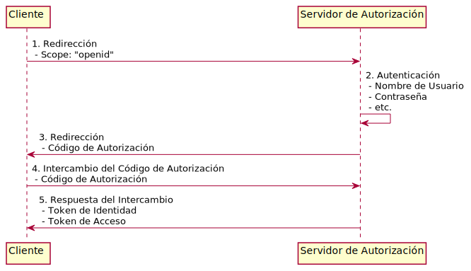

# Cómo la Tesorería General de la Republica de Chile usa Amazon Cognito, Lambda y DynamoDB para abstraer la lógica de autenticación de sus aplicaciones

La Tesorería General de la República (TGR) de Chile es la institución pública dependiente del Miniserio de Hacienda encargada de recolectar, custodiar y distribuir fondos y valores fiscales de los diferentes servicios públicos del país. Es responsable de darle a la ciudanía mecanismos para efectuar el pago de obligaciones al fisco y de pagar las obligaciones del gobierno a otras instituciones.

## El desafío

En el 2010 el Gobierno de Chile lanzó ClaveÚnica, una contraseña unificada para autenticar de manera digital la identidad de los ciudadanos chilenos y residentes mayores de catroce años. CláveÚnica sirve como puerta de entrada para todos los servicios virtuales que el Estado de Chile provee y tiene como objetivo facilitar el acceso a los trámites de manera digital,  aumentar las medidas de seguridad  y reducir los tiempos de espera. La TGR al ser uno de esos proveedores de servicios digitales se vió obligada a integrar sus aplicaciones usando ClaveÚnica y deprecar lentamente su sistema de autenticación legado.

## OpenID Connect

Tras bambalinas ClaveÚnica es un proveedor de identidad que implementa el protocolo OpenID Connect (OIDC). OIDC es una capa de identidad sobre OAuth 2.0 que le permite a las aplicaciones de terceros verificar la identidad del usuario final y obtener información básica del mismo. OIDC utiliza JSON Web Tokens (JWT) que obtiene mediante flujos que cumplen con las especificaciones de OAuth 2.0. El siguiente diagrama de sequencia resume el flujo de autenticación OIDC:

1. El *Cliente* inicia el flujo con la redirección del usuario a la URL del *Servidor de Autorización*, junto con ello envía los *Scopes*;  permisos granulares que el *Cliente* requiere que el usuario le otorgue. En este caso, para indicar que es un flujo OIDC, el *Cliente* incluye el *Scope* "oidc".
2. El usuario se autentica en el formulario de login del *Servidor de Autorización* y confirma que quiere otorgar los *Scopes* que el *Cliente* solicitó en el paso anterior.
3. El *Servidor de Autorización* confirma la identidad del usuario y luego redirecciona de vuelta al *Cliente*. Como parte de la redirección el *Cliente* envía un *Código de Autorización*.
4. El *Código de Autorización* es un código temporal y de corta duracción que el *Cliente* puede intercambiar por un *Token de Identidad*.
5. El *Cliente* recibe un *Token de Identidad* y un *Token de Acceso*. El *Token de Identidad* es un JWT del cual el *Cliente* puede extraer información del usuario como: id, nombre, fecha de incio de sesión, fecha de expiración del *Token de Identificación*, etc. El *Token de Acceso* es una llave que el *Cliente* puede usar para obtener información adicional de identificación como el email del usuario.

En el diagrama anterior las aplicaciones de la TGR cumplen el rol de *Cliente* mientras que ClaveÚnica cumple el rol del *Servidor de Autorización*. 

## Federando Identidades con Amazon Cognito

Uno de los desafíos de implementar flujo de OIDC es que todas las aplicaciones que necesiten autenticarse deben implementarlo. Para solucionar estos temas, la TGR implementó Amazon Cognito como intermediario entre sus aplicaciones y los distintos proveedores de identidad.

Amazon Cognito es un servico que permite incorporar de manera rápida y sencilla el registro, inicio de sesión y control de acceso a aplicaciones web y móviles. Amazon Cognito puede escalar a millones de usuarios y admite el inicio de sesión de proveedores de identidad como OIDC, SAML y redes sociales.

## 

Cuando la TGR 
